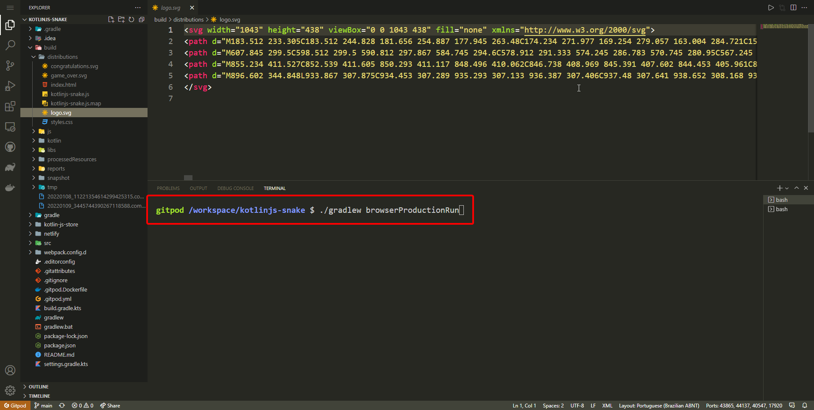
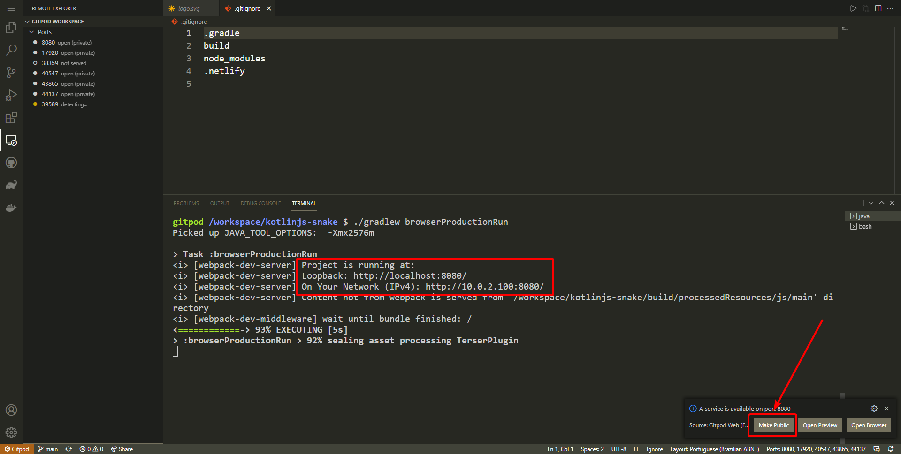
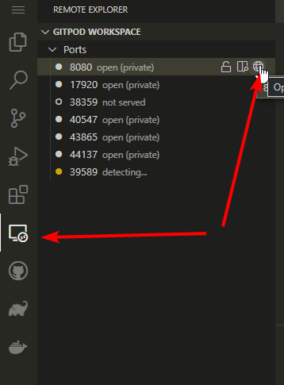
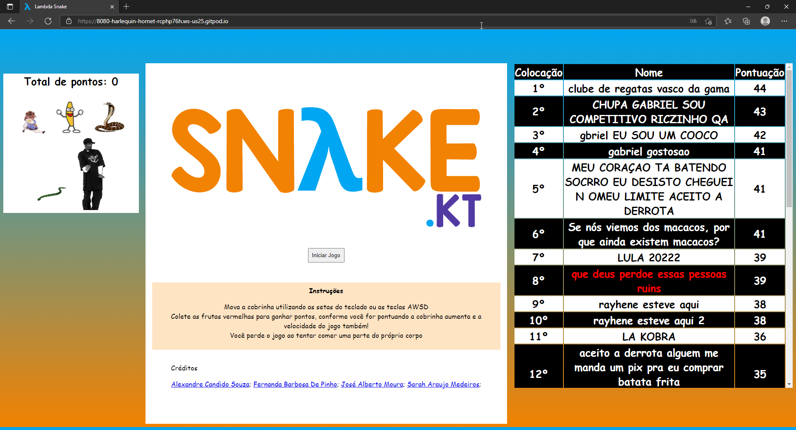

### Projeto da disciplina de Linguagem de Programação Funcional 2021.1 (jan/2022)


[](https://github.com/Quote023/lambda-snake.kt/issues)
[](https://github.com/Quote023/lambda-snake.kt/network)
[](https://github.com/Quote023/lambda-snake.kt/stargazers)
  

## 📄 Descrição 
> Implementação do Jogo Snake para Web utilizando a linguagem de programação Kotlin compilada para Javascript e a API de Canvas do navegador
> O jogo também conta com Placar salvo na nuvem onde os jogadores competem entre si.
## ♟️ Lógica e estrutura do código
O jogo consiste em um tabuleiro imutável iterado de tempo em tempo onde a peça do jogador sempre é movida para frente atualizando o tabuleiro recursivamente, ao entrar em contato com outras peças especiais como Frutas ou o próprio corpo do jogador são executadas ações especificas como adicionar pontos ou chamar a tela de game-over, o próximo estado do tabuleiro é sempre baseada no do estado anterior, porém o Input do usuário é impuro logo o processo não é deterministico.
## 🎮 Link do jogo
https://lambda-snake.netlify.app/

## 🚀 Tecnologias 

Aqui estão as tecnologias usadas neste projeto.

* Frontend: Kotlin/JS 
* Ferramenta de Build: Gradle e Webpack 
* Hospedagem: Netilify
* Funções Serverless: Netilify Functions com Javascript
* Comunicação com servidor: Api Rest 
## 🦾 Serviços usados

* [GitHub](https://github.com/Quote023/lambda-snake.kt)
* [Gitpod](https://gitpod.io/#/github.com/Quote023/kotlinjs-snake)
* [Netlify](https://www.netlify.com/)
* [JSONbin](https://jsonbin.org/)  


## ✔️ Status do projeto
Versão 1.0 OK

## 🖥️ Instalando e compilando o projeto do Jogo
* Clone o projeto 
```bash 
git clone https://github.com/Quote023/lambda-snake.kt 
```
* Para rodar o servidor de desenvolvimento com HOT-RELOAD use o comando 
```bash
./gradlew run -t
```
* Para gerar uma build de produção otimizada rode o comando
```bash
./gradlew build
``` 
será criada uma pasta ```/build/distributions/``` com os arquivos estáticos da aplicação, esses arquivos então podem ser servidos em qualquer servidor HTTP


## 🖱️ Rodando o projeto através do GITPOD
* Acesse o projeto no GITPOD [clicando aqui](https://gitpod.io/#/github.com/Quote023/kotlinjs-snake)
* Com o Terminal na raiz do projeto execute o comando
```bash
./gradlew browserProductionRun
```



* No terminal aparecerá a mensagem que o projeto está rodando na porta ```8080``` e no canto inferior direito da tela aparecerá uma mensagem confirmando que o serviço está disponível. Clique em ```Make Public``` para torná-lo acessivel:  



* Para acessar o serviço vá no menu ```Remote Explorer``` como indicado na imagem e selecione o botão ```Open Browser``` na Porta 8080:



* Você será levado para a seguinte aba e agora poderá jogar normalmente:



## 😎 Contribuidores 
<table>
  <tr>
    <td align="center">
      <a href="https://github.com/Quote023">
        <br>
        <sub>
          <b>Alexandre Candido Souza</b>
        </sub>
      </a>
    </td>
    <td align="center">
      <a href="https://github.com/nandasuna1">
        <br>
        <sub>
          <b>Fernanda Barbosa de Pinho</b>
        </sub>
      </a>
    </td>
    <td align="center">
      <a href="https://github.com/AlberttMoura">
        <br>
        <sub>
          <b>José Alberto Moura</b>
        </sub>
      </a>
    </td>
    <td align="center">
      <a href="https://github.com/SarahMedeir0s">
        <br>
        <sub>
          <b>Sarah Araujo Medeiros</b>
        </sub>
      </a>
    </td>
   
  </tr>
</table>

## 📝 Licença

Esse projeto está sob licença. Veja o arquivo [LICENÇA](LICENSE) para mais detalhes.
<br>
